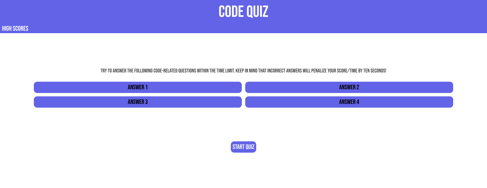

# Module 4 Challenge: Code Quiz 

## Description

This project was built to design a quiz that tests the user's knowledge on coding. It displays 5 total multiple choice questions with 4 possible answer buttons, and the user is timed. 10 seconds is deducted from the timer when the user selects the wrong answer. This project was built so that a user may test their knowledge on basic coding concepts. This project allowed me to test my knowledge on Javascript and apply previous concepts such as local storage, for loops, etc. 

## Usage

Once the webpage is opened, the user may read the instructions and press "START GAME" when they are ready to begin the quiz. A question will appear with 4 possible answers, and the user must select the correct answer to move onto the next question. If the wrong answer is selected, the selected answer will turn red and 10 seconds will be deducted from the timer. The user may keep selecting answers until they select the correct one, and/or the timer is up. At the end of the game, the user may input their initials to be stored and accessed for future reference. These scores can be viewed by clicking on the "HIGH SCORES" button at the top left corner of the page. If the user wants to play again, the user may press "PLAY AGAIN."

## Deployed Application

The live page is found at https://sagirikenaga.github.io/coding-quiz/. 

## Demo

The webpage appears as the following:

## Credits

Sagiri Ikenaga

